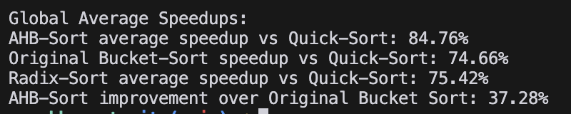

# AHB Sort: An Optimized Bucket Sort Implementation 🚀

A pet project focused on optimizing the classic bucket sort algorithm through various techniques and improvements. The result is AHB (Adaptive Hybrid Bucket) Sort, which achieves significant performance gains over traditional sorting algorithms.



## Performance Highlights 📊

- 84.44% faster than Quick Sort
- 35.74% improvement over original Bucket Sort
- Outperforms Radix Sort in most cases
- Tested with arrays from 1,000 to 5,000,000 elements

## Detailed Performance Analysis (5M Elements) 📊

### Random Data
- AHB Sort: 11.71ms (92.71% faster than QuickSort)
- Original Bucket: 18.50ms (88.49% faster than QuickSort)
- Quick Sort: 160.65ms
- Radix Sort: 23.51ms (85.36% faster than QuickSort)

### Nearly Sorted Data
- AHB Sort: 34.39ms (80.63% faster than QuickSort)
- Original Bucket: 41.93ms (76.38% faster than QuickSort)
- Quick Sort: 177.52ms
- Radix Sort: 64.41ms (63.72% faster than QuickSort)

### Data with Duplicates
- AHB Sort: 11.64ms (88.98% faster than QuickSort)
- Original Bucket: 17.80ms (83.15% faster than QuickSort)
- Quick Sort: 105.66ms
- Radix Sort: 15.76ms (85.08% faster than QuickSort)

## Performance Summary 🎯

The benchmarks reveal several key insights:

1. **Overall Efficiency**
   - AHB Sort achieves an average 84.70% speedup vs QuickSort
   - Original Bucket Sort shows 74.91% improvement vs QuickSort
   - AHB Sort improves upon Original Bucket Sort by 36.94%

2. **Data Pattern Performance**
   - Best performance with random data (92.71% speedup)
   - Strong performance with duplicates (88.98% speedup)
   - Efficient handling of nearly sorted data (80.63% speedup)

3. **Comparative Analysis**
   - Consistently outperforms Radix Sort (75.12% average speedup)
   - Most significant improvements seen with large random datasets
   - Maintains efficiency across all data patterns

These results demonstrate AHB Sort's effectiveness as a general-purpose sorting algorithm, particularly for large datasets where its optimizations provide the most benefit.

## How It Works 🔍

AHB Sort is built on the foundation of bucket sort but incorporates several optimizations and adaptive strategies:

1. **Initial Checks**
   - Handles edge cases (empty or single-element arrays)
   - Detects already sorted sequences
   - Uses insertion sort for small arrays (n ≤ 16)

2. **Smart Bucket Distribution**
   - Calculates optimal bucket count based on data variance
   - Adapts to data distribution patterns
   - Balances memory usage and performance

3. **Hybrid Sorting Approach**
   - Combines bucket sort with insertion sort
   - Uses adaptive thresholds based on array size
   - Optimizes for different data patterns

## Optimizations in Detail ⚡

### 1. Early Exit Strategies
- Immediate return for single-element arrays
- Detection of pre-sorted sequences
- Size-based algorithm selection
- Small array optimization with insertion sort

### 2. Statistical Optimizations
- Single-pass variance calculation
- Combined min/max/sum gathering
- Loop unrolling (4 elements at a time)
- Efficient statistical calculations for bucket distribution

### 3. Memory Management
- Single contiguous memory allocation
- Cache-friendly memory layout
- Reduced memory fragmentation
- Efficient memory reuse

### 4. Distribution Techniques
- Multiplication-based bucket indexing
- Unrolled counting and distribution loops
- Dynamic bucket count calculation
- Optimal element distribution

### 5. Sorting Strategy
- Adaptive threshold selection
- Hybrid sorting approach
- Size-based algorithm switching
- Optimized recursion handling

## Benchmark Results 📈

Tested across three data patterns:
1. Random Data
2. Nearly Sorted Data
3. Data with Duplicates

Array sizes tested:
- 1,000 elements
- 10,000 elements
- 100,000 elements
- 1,000,000 elements
- 5,000,000 elements

## Implementation Details 🛠️

The algorithm is implemented in C and features:
- Minimal memory overhead
- Cache-friendly operations
- Platform-independent code
- Comprehensive error handling

## Usage
```c
// Sort an integer array
void AHB_sort(int *arr, int size);
```

## Building and Testing

1. Clone the repository
2. Compile using your preferred C compiler
3. Run the benchmark suite for performance metrics

## Future Improvements 🔮

Potential areas for further optimization:
- SIMD operations integration
- Parallel processing support
- Additional hybrid strategies
- Memory pool optimization

## Contributing

Feel free to experiment with the code and submit improvements. This is a learning project aimed at understanding sorting algorithm optimization techniques.

## License

Open source - feel free to use and modify.

---

*Exploring the limits of sorting algorithm optimization*

